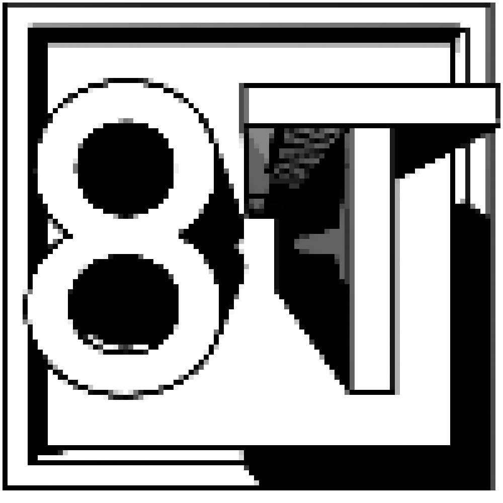
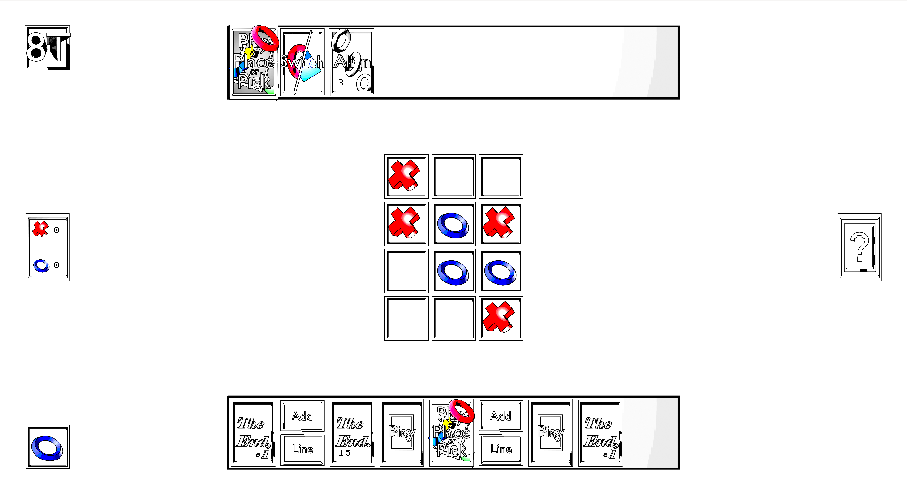

<h1 style="text-align=center; align=center;">
  
   
  The Turbocharged Topsy-Turvy Transmutable Tic-Tac-Toe
   
</h1>

8T is a board game that reinvents the traditional tic-tac-toe by introducing new rules, transforming the gaming experience. Initially played on a 3x3 board where players alternate between placing a circle and a cross in order to align three of their pieces, the game quickly becomes more complex. Each player can choose new rules to spice up the game, such as increasing the size of the board, activating gravity... The aim is no longer to win once by aligning the pieces, but to win as many times as possible, until one of the players decides to play the "game over in 10 turns" rule.

## Interface

## Requirement 

Build:
- On Windows, [Xmake](https://xmake.io/#/getting_started) is recommended, as it manages libraries automatically. With Cmake, libraries must be installed individually.
- On Linux, Xmake or Cmake should work just as well.

Libraries used:
- SDL2
- ImGui

Documentation:
- Doxygen

The font is integrated into the game by default. To download it separately: [Dogica font](https://www.dafont.com/dogica.font).

## Build

With Xmake:

~~~bash
xmake
xmake run
~~~

With Cmake:

~~~bash
mkdir build
cd build
cmake ..
make
cd ../bin
./graphic
~~~

## Documentation

Generate the documentation with Doxygen:
~~~bash
cd doc
doxygen Doxyfile
~~~

## Organisation 

1. `src`: contains all the sources files of the project
2. `data`: 
- `data/images`: contains all the images of the project
- `data/sounds`: contains the music of the project
3. `doc`: contains the documentation of the project and all the files for the oral presentation
4. `bin`: contains all the executable of the project
5. `font`: contains the font of the project
6. `CMakeLists.txt`: the file for the cmake compilation
7. `xmake.lua`: the file for the xmake compilation
8. README.md: file for all the information for the project